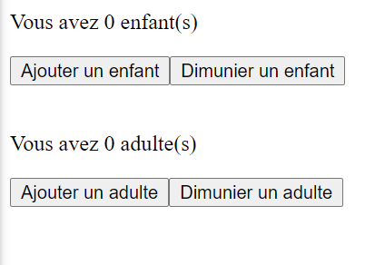

# 2. Les Composants

## 2.1. Notion de composant

Les composants vous permettent de diviser l'interface utilisateur en éléments indépendants et réutilisables . L'idée est de séparer une page en plusieurs petits composants réutilisables (Atomic desgin).

> Nous pouvons définir techniquement la notion de composant de deux manières différentes.

- **Le composant comme une fonction:** Un composant peut être une fonction qui reçoit en entrée des paramètres (props) et converti ces paramètres en éléments UI (JSX)

  ```jsx
  function WelcomeMessage(props) {
    return (
      <h1>
        Bienvenu sur le site de Bercy <em>{props.userName}</em>
      </h1>
    );
  }
  // Appel du composant
  <WelcomeMessage userName="Christophe" />;
  ```

  [JsFiddle](https://jsfiddle.net/thies05/9nkvzase/318/)

- **Le composant comme une classe:** Un composant peut être une class qui étends **React.Component** et qui définit la methode **render()**. Cette methode retourne du JSX et peut acceder au paramètre (props) du composant via **this.props**.

  ```jsx
  class WelcomeMessage extends React.Component {
    render() {
      return (
        <h1>
          Bienvenu sur le site de Bercy <span>{this.props.userName}</span>
        </h1>
      );
    }
  }
  // Appel du composant
  <WelcomeMessage userName="Christophe" />;
  ```

  [JsFiddle](https://jsfiddle.net/thies05/9nkvzase/45/)

> - React considère les composants commençant par des lettres minuscules comme des balises DOM. Par exemple, **\<div />** représente une balise HTML div, mais **\<WelcomeMessage />** représente un composant, et exige que l’identifiant WelcomeMessage existe dans la portée courante.
> - Les Props d'un composant sont immutables
>
>   ```javascript
>   // Ce code plante
>   this.props.userName = "Titi";
>   ```

### 2.2 Composant avec état

La notion d'état en React Répond à deux besoins qui sont :

- **Isolé du comportement**: L'idée est de vous permet de découper votre interface en des composants independants et réutilisables ce qui vous permet de concevoir chaque composant de manière isolée.
- **Répondre au changement**: Les applications sont dynamiques, elles changent en fonction des actions utilisateur. Pour mettre en place ces changements, React mets à disposition la notion d'etat.

> _**setState()** est une methode de l'API React qui permet de definir et manipuler l'etat d'un composant_.

```jsx
class ChildrenCounter extends React.Component {
  constructor(props) {
    super(props);
    this.state = { childrenCount: 0 };
  }

  addChildren() {
    this.setState({
      childrenCount: this.state.childrenCount + 1,
    });
  }

  render() {
    return (
      <div>
        <p>Vous avez {this.state.childrenCount} enfant(s)</p>
        <button onClick={() => this.addChildren()}>Ajouter un enfant</button>
      </div>
    );
  }
}
```

[JsFiddle](https://jsfiddle.net/thies05/9nkvzase/212/)

#### Quelque règles du state

Le state doit obeir à ces règles suivantes:

> - On ne peut pas modifier l’état directement
> - Les mises à jour de l’état sont fusionnées

[JsFiddle](https://jsfiddle.net/thies05/9nkvzase/249/)

### 2.3 Cycle de vie d'un composant

React met à disposition une API qui permet de gérer le cycle de vie des composants. Cette API est notamment utile quand il faut allouer ou libérer les ressources utilisées par les composants quand ils sont détruits.

- **Quand le composant est monté :** la méthode **componentDidMount()** permet d’exécuter du code quand le composant est monté _i.e quand le composant apparait dans l’arbre DOM_.
- **Quand le composant est démonté :** la méthode **componentWillUnmount()** permet d’exécuter du code quand le composant est démonté _i.e quand le composant est supprimé dans l’arbre DOM._

```jsx
class ChildrenCounter extends React.Component {
  constructor(props) {
    super(props);
    this.state = { childrenCount: 0 };
  }

  componentWillMount() {
    console.info("component will mount");
  }

  componentDidMount() {
    console.info("component did mount");
  }

  componentWillUnmount() {
    console.info("component will unmount");
  }

  addChildren() {
    this.setState({
      childrenCount: this.state.childrenCount + 1,
    });
  }

  render() {
    return (
      <div>
        <p>Vous avez {this.state.childrenCount} enfant(s)</p>
        <button onClick={() => this.addChildren()}>Ajouter un enfant</button>
      </div>
    );
  }
}

function App() {
  return (
    //Appel du composant
    <ChildrenCounter />
  );
}

ReactDOM.render(<App />, document.querySelector("#app"));
setTimeout(() => {
  ReactDOM.unmountComponentAtNode(document.querySelector("#app"));
}, 5000);
```

[JsFiddle](https://jsfiddle.net/thies05/9nkvzase/320/)

**:weight_lifting_man: Exercice 3: Creation d'un composant FamilyCounter pour Bercy**

Créer un composant **FamilyCounter**, qui permet :

- D’ajouter d’ajouter le nombre d’adulte et diminuer le nombre d’enfants
- D’ajouter d’ajouter le nombre d’adulte et diminuer le nombre d’adultes
- Le nombre d'enfants et d'adultes ne doit pas être inferieur à 0



<!-- [JsFiddle: Solution](https://jsfiddle.net/thies05/9nkvzase/325/) -->

#### 2.3 Intoduction aux Hooks

Avant la version **_16.8_** on utilisait les classes ou **recompose** pour gerer l'état du composant. Les classes offrent la possibilité d'utiliser les fonctionnalités de React comme par exemple le **lifecycle** ou encore le **state**.

Depuis la version **16.8**, on a la possibilité de créer des composants fonctionnels à etat de manière native.

### 2.3.1 Comment gérer l’état d'un composant fonctionel

> **Qu’est-ce qu’un Hook ?** Un Hook est une fonction qui permet de « se brancher » sur des fonctionnalités React. (source reactjs.org)

### Le hooks useState

Dans une classe, on initialise l’état local childrenCount à 0 en définissant this.state à { childrenCount: 0 } dans le constructeur. Dans une fonction composant, nous ne pouvons pas écrire ou lire **this.state** puisqu’il n’y a pas de **this**. Le Hook **useState** nous permet d'ajouter un etat local à notre composant fonctionnel.

```jsx
const [childrenCount, setChildrenCount] = React.useState(0);
```

- **Que fait le code ci-dessus ?**
  Ça déclare une « variable d’état ». Notre variable est appelée childrenCount mais nous aurions pu l’appeler n’importe comment, par exemple banane. C’est un moyen de « préserver » des valeurs entre différents appels de fonctions.

- **A quoi correspond l'argument ?**
  Le seul argument à passer au Hook useState() est l’état initial. Contrairement à ce qui se passe dans les classes, l’état local n’est pas obligatoirement un objet. Il peut s’agir d’un nombre ou d’une chaîne de caractères si ça nous suffit.
- **Que renvoie useState ?**
  Elle renvoie une paire de valeurs : l’état actuel et une fonction pour le modifier. C’est pourquoi nous écrivons const [count, setCount] = useState(). C’est semblable à this.state.count et this.setState dans une classe, mais ici nous les récupérons en même temps.

Transformons notre composant ChildrenCounter en composant fonctionnel

```jsx
function ChildrenCounter() {
  // Déclare une nouvelle variable d'état, que l'on va appeler « count »
  const [childrenCount, setChildrenCount] = React.useState(0);
  return (
    <div>
      <p>Vous avez {childrenCount} enfant(s)</p>
      <button onClick={() => setChildrenCount(childrenCount + 1)}>
        Ajouter un enfant
      </button>
    </div>
  );
}
```

[JsFiddle](https://jsfiddle.net/thies05/9nkvzase/186/)

**:weight_lifting_man: Exercice 4: Transformer le composant FamilyCounter en Functionnal component**
Amusez-vous :) !

### Remarque
> - _Apporte de la simplicité_
> - _La Core team React pousse dans son ensemble l’utilisation des Functionnals components avec les Hooks à la place des classes._
> - _Chez **AXA** on s’est inscrit dans cette dynamique._

#### 2.4 Styliser vos Composants ReactJs
### 2.4.1 Inline styles
Les styles en ligne(Inline Styles) ressemblent et fonctionnent un peu comme CSS, avec quelques différences. Les styles en ligne affectent directement la balise dans laquelle ils sont écrits, sans l'utilisation de sélecteurs. Voici une page HTML de base utilisant inline styles:
```html
<!DOCTYPE html>
<html>
  <head>
    <title>Playing with Inline Styles</title>
  </head>
  <body>
    <p style="font-family: sans-serif; text-align: center; color: red; background-color: yellow;}">
      I'm a big, blue, <strong>strong</strong> paragraph
    </p>
  </body>
</html>
```
Il est toujours possible avec ReactJs de styliser vos élements via l'attribut style

[jsFiddle](https://jsfiddle.net/thies05/9nkvzase/364/)

### 2.4.2 Css file/className

Il est possible de sortir le style dans des fichiers CSS et de les importer dans nos composants.
C’est la bonne pratique préconisée par la team React, pour plus d’information ([La doc ReactJs](https://fr.reactjs.org/docs/dom-elements.html#style)

```css
.monStyle {
  font-family: sans-serif;
  text-align: center;
  color: red;
  background-color: yellow;
  font-size: 40px;
}
```

Pour appliquer le CSS sur nos éléments nous devons utiliser la propriété **className** comme suit :

```jsx
import React from "react";
import "./styles.css";

class ChildrenCounter extends React.Component {
  constructor(props) {
    super(props);
    this.state = { childrenCount: 0 };
  }
  
  addChildren() {
    this.setState({
     childrenCount: this.state.childrenCount + 1
    });
  }
  
  render() {
    return (
        <div>
          <p className="monStyle">Vous avez {this.state.childrenCount} enfant(s)</p>
          <button onClick={() => this.addChildren()}>
            Ajouter un enfant
          </button>
        </div>
      );
  };
}
```

