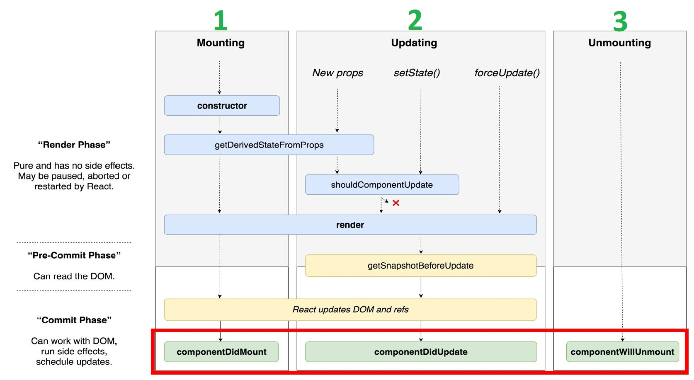
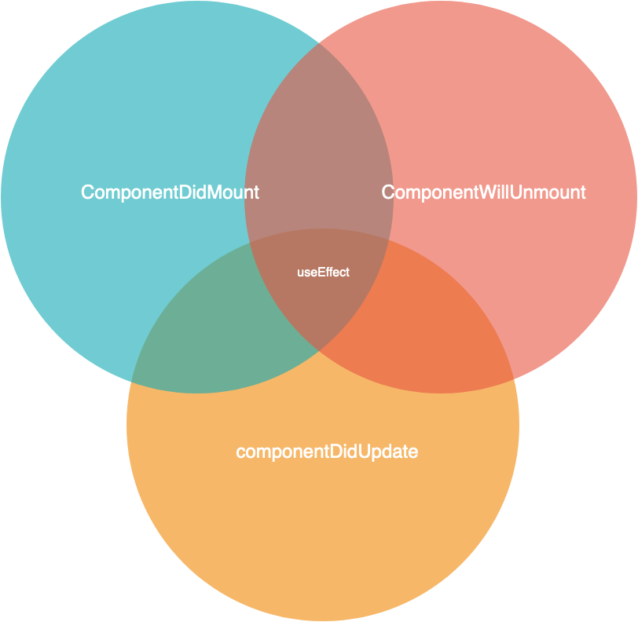

# 7 La gestion des effets de bord en ReactJs

## 7.1 introduction des effets de bord

Un effet de bord «side effect» est tout ce qui affecte quelque chose en dehors de la portée(scope) de la fonction en cours d'exécution.
Celles-ci peuvent être, par exemple :

- Une requête réseau.
- Faire l'authentification Oauth.
- Manipulation du dom directe.
- Mise à jour du cache.
- faire du logging.

<blockquote>Nous Allons voir comment Reactjs nous facilite la gestion des effets de bord.</blockquote>

## 7.2 Cycle de vie + Schéma du workflow

<div style="text-align:center"></div>

Nous avons déjà vue en détail les méthodes du cycle de vie d'un composant React basé sur une classe dans le [deuxième Dojo](https://github.com/barry-thierno/bercy/blob/react_dojo_instructions/src/composant.md).

Prenons les exemples suivants

- <blockquote>Faire un appel réseau</blockquote>

```jsx
class Component extends React.Component {
  constructor(props) {
    super(props);
    this.state = { data: '' };
  }

  componentDidMount() {
    // Appel vers une API qui nous renvoie les tranches d'impôts au chargement du composant.
    fetchData('/getTranches').then((data) => this.setState({ data }));
  }

  render() {
    return <div>{this.state.data}</div>;
  }
}
```

- <blockquote>Inscriptions/désinscription à des événements</blockquote>

```jsx
  componentDidMount() {
    // dans cette méthode de cycle de vie nous faisons l'inscription
    ChatAPI.subscribeToFriendStatus(this.props.friend.id);
  }
  componentWillUnmount() {
    // dans cette méthode de cycle de vie nous faisons la désinscription
    ChatAPI.unsubscribeFromFriendStatus(this.props.friend.id);
  }

```

```jsx

  componentDidMount() {
    // dans cette méthode de cycle de vie nous faisons l'inscription à l'événement du resize
    window.addEventListener("resize", () => this.setState({width: window.innerWidth}));
  }
  componentWillUnmount() {
    // dans cette méthode de cycle de vie nous faisons la désinscription de l'événement du resize.
    window.removeEventListener("resize", () => this.setState({width: window.innerWidth}));
  }

```

- <blockquote>Manipuler directement le Dom</blockquote>

```jsx
class Component extends React.Component {
  constructor(props) {
    super(props);
    this.state = { count: 0 };
  }

  componentDidMount() {
    //Lors du chargement du composant
    document.title = `Vous avez cliqué ${count} fois`;
  }

  componentDidUpdate() {
    //Lors de la mise à jour du composant
    document.title = `Vous avez cliqué ${count} fois`;
  }

  //Notez la duplication de code entre ces deux méthodes de cycle de vie du composant.

  handleChange(event) {
    this.setState({ count: event.target.value });
  }

  render() {
    return (
      <div>
        <input value={this.state.count} onChange={this.handleChange} />
      </div>
    );
  }
}
```

<blockquote>A partir des exemples au-dessus nous déduisons que nous pouvons gérer les effets de bords avec les 3 méthodes du cycles de vie suivants:  <i><b>componentDidMount, componentDidUpdate et componentWillUnmount</b></i>,</blockquote>

#### Pouvons-nous faire la même chose avec un composant fonctionnel?

#### Le réponse est **OUI** :D

<p align="center">
  
</p>

## 7.3 Le hook useEffect

### 7.3.1 introduction du hook useEffect

```jsx
useEffect(callbackFn, dependencies[optionl]);
```

Le hook <code>useEffect</code> est un hook qui va nous permettre de déclencher une fonction(effet de bord) de manière asynchrone lors du changement de l'état d'un composant.
Nous pouvons dire que le hook <code>useEffect</code> est un alternatif aux méthodes du cycle de vie : <code>componentDidMount, componentDidUpdate et componentWillUnmount</code>.

<table>
  <tr>
    <td></td>
    <td></td>
  </tr>
 </table>

<blockquote>
Le hook <code>useEffect</code> est une  méthode qui prend deux paramètres <code>useEffect(callbackFn, dependencies[optionl])</code>;

- <code>callbackFn</code> : est la fonction qui sera exécutée lorsqu'une des dépendances change (cette fonction est exécutée de manière asynchrone et ne bloquera pas le rendu du composant).
- <code>dependencies</code> : est un tableau qui permet de définir les dépendances de ce hook dans un but d’optimisation (La fonction(callbackFn) sera exécutée uniquement si une des valeurs du tableau a été modifiée depuis l’appel précédent).
</blockquote>

Nous allons essayer de convertir quelques exemples vus précédemment.

Commençons par la manipulation du dom(<code>document</code>) dans un composant fonctionnel

```jsx
import React, { useState, useEffect } from 'react';

export default function Component() {
  const [id, setId] = useState(0);
  const [name, setName] = useState('Yannick');

  // Similaire à componentDidMount et componentDidUpdate :
  useEffect(() => {
    document.title = `Hello ${name}`;
  });

  return (
    <div>
      <p>Hello {name}</p>
      <input type="text" onChange={({ target }) => setName(target.value)} />
      <button onClick={() => setId(id + 1)}>Cliquez ici</button>
    </div>
  );
}
```

[code source](https://codesandbox.io/s/useeffect-qz0n8?file=/src/App.js:0-505)

Nous allons prendre un exemple qui nous permet d'illustrer l'importance du deuxième paramètre<<code>dependencies</code>> du hook <code>useEffect</code>.

```jsx
import { useState, useEffect } from 'react';

function Component() {
  const [count, setCount] = useState(0);
  const [name, setName] = useState('John');

  // Similaire à componentDidMount et componentDidUpdate :
  useEffect(() => {
    // Met à jour le titre du document via l’API du navigateur
    document.title = `You clicked ${count} times`;

    // Afficher un pop-in
    alert(`Vous avez cliqué ${count} fois`);
  });

  return (
    <div>
      <div>
        <p>Bonjour {name}</p>
        <input type="text" value={name} onChange={(ev) => setName(ev.target.value)} />
      </div>
      <div>
        <p>Vous avez cliqué {count} fois</p>
        <button onClick={() => setCount(count + 1)}>Cliquez ici</button>
      </div>
    </div>
  );
}
```

<blockquote> Problème constaté: Chaque modification de la valeur du champ text:

- Met à jour le state text du composant.
- provoque re-render du composant.
- Force l'exécution de fonction passée en paramètre à useEffect ce que nous ne souhatons pas lors du chargement du text.

Alors pour remédier à ce problème il faut utiliser le deuxième paramètre <code>tableau de dépendances</code> qui nous permet d'exécuter la fonction uniquement si une des valeurs du tableau a été modifiée depuis l’appel précédent </blockquote>

### 7.3.1 Les types du hook useEffect

Il existe deux grands types d’effets de bord dans les composants React : ceux qui ne nécessitent pas de nettoyage, et ceux qui en ont besoin.
Examinons cette distinction en détail.

## Effets sans nettoyage

Parfois, nous souhaitons exécuter du code supplémentaire après que React a mis à jour le DOM. Les requêtes réseau, les modifications manuelles du DOM, et la journalisation sont des exemples courants d’effets qui ne nécessitent aucun nettoyage. Cela s’explique par le fait qu’ils peuvent être oubliés immédiatement après leur exécution. Comparons donc la manière dont les classes et les Hooks nous permettent d’exprimer ce genre d’effets de bord.

```jsx
function Component() {
  const [name, setName] = useState('John');

  function handleChangeName(e) {
    setName(e.target.value);
  }

  useEffect(() => {
    document.title = `Welcome ${name}`;
    alert(`Bonjour ${name}`);
  });

  return <input type="text" value={name} onChange={handleChangeName} />;
}
```

## Effets avec nettoyage

Nous avons vu précédemment comment écrire des effets de bord ne nécessitant aucun nettoyage. Toutefois, quelques effets peuvent en avoir besoin. Par exemple, nous pourrions souhaiter nous abonner à une source de données externe. Dans ce cas-là, il est impératif de nettoyer par la suite pour éviter les fuites de mémoire ! Comparons les approches à base de classe et de Hooks pour y arriver.

```jsx
import React, { useState, useEffect } from 'react';

function Component({ friend }) {
  useEffect(() => {
    // ici nous faisons l'inscription
    ChatAPI.subscribeToFriendStatus(friend.id);

    return function cleanup() {
      // ici nous faisons la désinscription
      ChatAPI.unsubscribeFromFriendStatus(friend.id);
    };
  });

  return friend.isOnline ? 'Online' : 'Offline';
}
```

```jsx
import React, { useState, useEffect } from 'react';

function Component() {
  // Gestion de la taille de l'écran
  const [width, setWidth] = useState(window.innerWidth);
  useEffect(() => {
    const handleResize = () => setWidth(window.innerWidth);

    window.addEventListener('resize', handleResize);

    return function cleanup() {
      window.removeEventListener('resize', handleResize);
    };
  }, [width]);

  return <p>{width}</p>;
}
```

## 7.4 Appels asynchrones

L’api Javascript Fetch est vraiment simple à utiliser. Il vous suffit d’utiliser la fonction fetch() avec une url pour effectuer une requête, GET par exemple. La librairie fonctionne avec des promesses, on peut donc utiliser then catch et finally.

Nous allons utiliser notre composant <code>FilterableSliceTable</code> pour faire un appel asynchrone.  
Pour la config Proxy, il s’agit juste de mettre le lien du serveur dans le package.json.

Vous retrouvez l'ensemble des services qui vous avez dû réaliser lors de la formation C# de bercy ici : [Swagger Bercy](https://bercywebapi.azurewebsites.net/swagger/index.html)

Pour avoir les tranches d'imposition par année, nous avons besoin de faire un appel au service Slices.

Utilisons comme exemple le composant <code> FilterableSliceTable </code> précédemment développé dans ce dojo.

```jsx
import React, { useState } from 'react';
import { Table } from '@axa-fr/react-toolkit-all';
import { SliceYearSelect } from 'pages/Home/FilterableSliceTable/SliceYearSelect/SliceYearSelect';
import { SliceTableHeader } from 'pages/Home/FilterableSliceTable/SliceTableHeader/SliceTableHeader';
import { SliceTableRow } from 'pages/Home/FilterableSliceTable/SliceTableRow/SliceTableRow';

export const FilterableSliceTable = () => {
  const [selectedYear, setSelectedYear] = useState('2020');
  const selectedTranches = getAllTranches().find((t) => t.year === selectedYear).tranches;

  return (
    <section className="af-panel">
      <header className="af-panel__header">
        <SliceYearSelect selectedYear={selectedYear} setSelectedYear={setSelectedYear} />
      </header>
      <div className="af-panel__content">
        <Table className="af-table">
          <SliceTableHeader />
          <Table.Body>
            {selectedTranches.map(({ id, lowBorn, highBorn, rate }) => (
              <SliceTableRow key={id} lowBorn={lowBorn} highBorn={highBorn} rate={rate} />
            ))}
          </Table.Body>
        </Table>
      </div>
    </section>
  );
};
```

Nous allons supprimer l’appel à la fonction <code> selectedTranches </code> pour le remplacer par la fonction Fetch. Nous connaissons déjà l’année sélectionnée, elle se trouve dans la variable <code> selectedYear </code>.

Comme le lien du serveur est déjà renseigné dans le proxy du package.json, il ne nous reste plus qu’à renseigner le nom du service, c’est-à-dire <code> Slices </code>. Pour récupérer les données, l’appel au service se fera via un GET. L’envoi de l’année sélectionnée se fera via un paramètre dans l’url.

```jsx
import React, { useState, useEffect } from 'react';
import { Table } from '@axa-fr/react-toolkit-all';
import { SliceYearSelect } from 'pages/Home/FilterableSliceTable/SliceYearSelect/SliceYearSelect';
import { SliceTableHeader } from 'pages/Home/FilterableSliceTable/SliceTableHeader/SliceTableHeader';
import { SliceTableRow } from 'pages/Home/FilterableSliceTable/SliceTableRow/SliceTableRow';

export const FilterableSliceTable = () => {
  const [selectedYear, setSelectedYear] = useState('2020');
  const [selectedTranches, setSelectedTranches] = useState([]);

  useEffect(() => {
    fetch(`/Slices?year=${selectedYear}`)
      .then((response) => response.json())
      .then((json) => {
        setSelectedTranches(json);
      });
  });

  return (
    <section className="af-panel">
      <header className="af-panel__header">
        <SliceYearSelect selectedYear={selectedYear} setSelectedYear={setSelectedYear} />
      </header>
      <div className="af-panel__content">
        <Table className="af-table">
          <SliceTableHeader />
          <Table.Body>
            {selectedTranches.map(({ low, high, rate }, index) => (
              <SliceTableRow key={id} lowBorn={lowBorn} highBorn={highBorn} rate={rate} />
            ))}
          </Table.Body>
        </Table>
      </div>
    </section>
  );
};
```

Mais avec cette méthode il y aura deux problèmes :

- Cas du re-render avec un autre composant :
  Votre application chargée, le <code> useEffect </code> exécutera la fonction et appellera le web service. Dès la fonction exécutée, vous continuerez à utiliser votre application. Quand par exemple vous allez cliquer sur le bouton <code> calculer </code>, vous allez mettre à jour votre <code> state </code>, cela va provoquer un re-render de l’application et ainsi appeler à nouveau le service.

- Cas de l’appel infini si on utilise un setter dans useEffect :
Une fois votre application chargée, le <code> useEffect </code> va exécuter la fonction qui appellera le web service. S’il répond positivement, vous pouvez appeler votre setter pour mettre à jour les données, dans notre cas, les tranches et leur taux d’imposition. Mais en exécutant le setter, il va re-render votre composant qui réexécutera la même fonction dans le UseEffect … vous l’aurez compris cela va faire une boucle infinie.
  <div style="text-align:center"><figure>
    
    <figcaption text-aligh="center" >Pouvons-nous faire la même chose avec un composant fonctionnel</figcaption>
</figure></div>

Pour remédier à ce problème, dans les deux cas, il faut utiliser le deuxième paramètre tableau de dépendances dans le <code> useEffect </code>. Cela va permettre d'exécuter la fonction, uniquement si une des valeurs du tableau a été modifiée depuis l’appel précédent.

```jsx
useEffect(() => {
  fetch(`/Slices?year=${selectedYear}`)
    .then((response) => response.json())
    .then((json) => {
      setSelectedTranches(json);
    });
}, [selectedYear]);
```

Dans notre cas, si la valeur de l’année sélectionnée ne change pas, alors le service ne sera pas rappelé. Assez de théorie, nous allons passer à quelques exercices 😉

**:weight_lifting_man: Exercice 7.4.1 : Appeler le service TaxComputer**

Allez directement sur [Swagger Bercy](https://bercywebapi.azurewebsites.net/swagger/index.html). Nous retrouvons le service <code>TaxComputer</code> qui va nous permettre de calculer le montant mais aussi le taux d’imposition.

Vous allez devoir mettre en place cet appel dans le composant <code> TaxComputationForm </code>.
Pour vous aider voici un exemple de code qui permet d’appeler un service en POST .

```jsx
fetch('/NomDuService', {
  method: 'POST',
  headers: {
    'Content-Type': 'application/json',
  },
  body: JSON.stringify(/* votre input ici */),
})
  .then((response) => response.json())
  .then((json) => {
    /* votre code */
  });
```

Dans le premier paramètre, vous devrez mettre le nom du service, et dans le second quelques paramètres :

- Method : la méthode que vous voulez utilisez, GET, POST, PUT, DELETE….
- Headers : quelques paramètres plus techniques mais importants
- Body : l’objet que vous voulez envoyer au service

Dans notre exercice, le service se nomme <code> TaxComputer </code>, le header reste le même que dans l’exemple, et le body devra recevoir un objet comme ceci :

```jsx
    const input = {
        wage: <code> le salaire </code>,
        year: <code> année </code>,
        taxHouseholdComposition: {
        nbAdults: “nombre adulte”,
        nbChildren: “nombre enfant”,
        },
    };
```

On pourra récupérer la réponse du service dans le bloc then() et les données grâce à la variable response. Dans cette dernière vous trouverez les données de la requête HTTP, le header, le body et les paramètres.

Vous devrez effectuer la mise à jour des données avec votre setter dans le second bloc <code> Then </code>.
Attention, le service ne renvoie que le montant de l’impôt <code> amount </code> et le taux d’imposition <code> marginalTaxRate </code>.

Pour mettre à jour le nombre de parts, vous devez utiliser une fonction comme vous le réalisiez auparavant avec le computeTaxeService. Ici vous devez utiliser la fonction <code> calculerNbParts</code>, elle reçoit deux paramètres : le nombre d’adultes en premier et le nombre d’enfants en second. Respectez bien l’ordre, celui-ci est très important😉

**:weight_lifting_man: Exercice 7.4.2 : Mettre en place un message d’erreur**

Voilà, vous avez appeler le service et mettre à jour les données dans le composant !!! Mais que se passerait-il si le service renvoyait une erreur ?

Dans la plupart des applications modernes, on utilise un message d’alerte pour avertir l’utilisateur s’il manque des données dans le formulaire par exemple ou si le service est KO et nous renvoie une erreur.

L’exercice est simple, vous allez mettre en place un message d’information quand le service est en erreur. Pour ce faire, mettez en place le composant <code> Alert </code> du toolkit Axa dans le composant <code> TaxComputationForm </code>

```jsx
<Alert
  classModifier="error"
  title="une erreur est survenue, veuillez vérifier les données saisies."
/>
```

Attention à ne pas oublier l’import dans l’entête du composant. Pour afficher ou non le message d’erreur, il faudra créer une variable de type booleen ainsi que son setter. Pour conditionner l'affichage je vous renvoie aux chapitres précédents, [ici](https://github.com/barry-thierno/bercy/blob/react_dojo_instructions/src/jsx.md#134-conditions).

Mais comment récupérer une erreur ? Si pour une raison X la fonction fetch retourne une erreur, on peut la récupérer avec le bloc catch(). Dans cette fonction on obtient une variable, par exemple <code> error </code> qui permet d’obtenir des informations.

```jsx
      .catch(() => {
        /* votre code */
      })
```

Allez c’est parti, à vos claviers ! 😉

**:weight_lifting_man: Exercice 7.4.3 : Et …. ce n’est pas fini !**

<code>Then(), Catch et finally()</code> .. Et oui, il reste encore un cas que nous allons utiliser. Quand l’utilisateur va cliquer sur le bouton "calculer", on appelle un service.

Mais visuellement pour qu’il comprenne bien que le calcul est en cours, on affiche un spinner. Un cercle qui tourne, qui s’affiche en pleine page et qui bloque toutes autres actions de l’utilisateur. Et oui cela a aussi une fonction pratique.

Dans le toolkit Axa, il existe un loader, voici son code :

```jsx
<Loader
    mode='none'
    text='votre texte'
    className='af-loader'
    classModifier='spinner'
>
```

Le code du bloc <code>finally</code>

```jsx
      .finally(() => {
        /* votre code */
      })
```

N’oubliez pas d’ajouter ce code CSS !!!

```css
.af-loader.af-loader--spinner.af-loader-on {
  position: fixed !important;
  z-index: 100;
}
.af-loader {
  min-height: auto !important;
}
```

Son mode de fonctionnent n’est pas des plus simples mais je vais tenter de vous l’expliquer.
Alors pour afficher le spinner sur votre page, la props <code>mode</code> du composant doit être ‘Get’, ‘Post’ etc …. Et pour ne plus l’afficher, ‘none’. Il faudra donc créer une variable avec son setter, la positionner avant le fetch avec le mode ‘Post’, et dans le bloc finally avec le <code>mode</code> ‘none’.

Je compte sur vous, à vos claviers 😊
