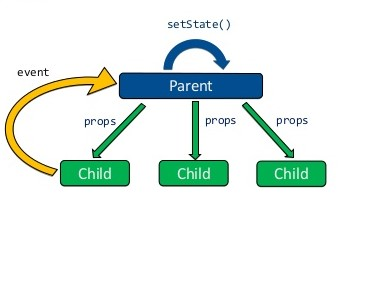
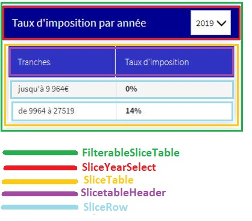

# 5. Formulaires

## 5.1 Events

## 5.2 Validation de saisies

# 6. Faire communiquer des composants

Jusqu’à maintenant, nous avons appris à créer des composants à avec un état interne. Cependant les composants ont besoin d’échanger de l’informations entre eux.
Par exemple, dans le cas de notre projet Bercy, le composant qui permet de sélectionner l’année doit échanger de l’information avec le composant qui permet de lister les tranches d’imposition.
Pour faire communiquer des composants, React propose le pattern de _**"communication unidirectionnel"**_ ou _**"unidirectional data flow"**_ ou _**"One way Data flow"**_
L'idée

> _La communication unidirectionnelle suggère que les données circulent dans une direction, du parent à l'enfant._



Pour mettre en oeuvre ce pattern, il faudrait passer par ces étapes: la hiérarchisation des composants, le passage des props et des callbacks

## 6.1 Hiérarchisation des composants

L’idée est de décomposer l’interface utilisateur en une hiérarchie de composants tout en identifiant les composants père et fils. Dans notre nous allons décomposer le composant qui permet d’afficher les tranches d’imposition comme suit :



**:weight_lifting_man: Exercice 6.1 : construire une version statique du composant qui permet d’afficher les tranches :**

Vous trouverez ci-dessous l'intégration qui permet de construire le composant d'affichage des tranches

- Créez un fichier **FilterableSliceTable.jsx**
- Créez un composant fonctionnel qui va s'appeller **FilterableSliceTable**
- Appéller le composant **FilterableSliceTable** dans le ?????
- Copiez et collez ci-dessous et faites les imports necessaires
- En se servant des commentaires laissés dans le code, sortez des composants fonctionnels conformement à la hierachie presentée plus haut (Dans le même fichier)

```jsx
// FilterableSliceTable
<aside className="tax-calculation_maximum-ceiling">
  <section className="af-panel">
    <header className="af-panel__header">
      // SliceYearSelect
      <span className="af-panel__title">Taux d'imposition par année</span>
      <SelectBase
        key="key"
        name="name"
        options={[
          { value: "2019", label: "2019" },
          { value: "2020", label: "2020" },
        ]}
        value="2020"
      />
    </header>
    <div className="af-panel__content">
      // SliceTable
      <Table className="af-table">
        // SliceTableHeader
        <Table.Header>
          <Table.Tr>
            <Table.Th>
              <span className="af-table-th-content">Tranches</span>
            </Table.Th>
            <Table.Th>
              <span className="af-table-th-content">Taux d'imposition</span>
            </Table.Th>
          </Table.Tr>
        </Table.Header>
        <Table.Body>
          // SliceTableRow
          <Table.Tr>
            <Table.Td>
              <span className="af-table-body-content">jusqu'à 9 964€</span>
            </Table.Td>
            <Table.Td>
              <b>0%</b>
            </Table.Td>
          </Table.Tr>
          // SliceTableRow
          <Table.Tr>
            <Table.Td>
              <span className="af-table-body-content">de 9964 à 27519</span>
            </Table.Td>
            <Table.Td>
              <b>14%</b>
            </Table.Td>
          </Table.Tr>
        </Table.Body>
      </Table>
    </div>
  </section>
</aside>
```

## 6.2 Flow descendant (props)

Selon pattern unidirectionnel, les composants parents peuvent passer de l'informations à leur fil. L'idée est que le composant parent crée et passe son état au composant fils via les props.

**:weight_lifting_man: Exercice 6.1 : Dynamiser le tableau qui permet d'afficher les tranches d'imposition :**

- Déclarer le state qui permet de selectionner l'année et nommé le selectedYear: _inspirez vous du pattern unidirectionnel et du decoupage fait precedement pour choisir le bon endroit_
- Votre état de avoir la valeur 2020 par defaut.
- Afficher les tranches et le taux dans le composant SliceTableRow (boucle et passage de props)
- Vous disposez ci-dessous d'une fonction qui retourne les tranches pour les années 2019 et 2020

```javascript
const findTranchesByYear = (year) => tranches.find((t) => year === year);
const getAllTranches = () => [
  {
    year: 2019,
    tranches: [
      {
        id: 1,
        tauxImposition: 0.0,
        limiteInf: 0,
        limiteSup: 10064,
      },
      {
        id: 2,
        tauxImposition: 0.11,
        limiteInf: 10064,
        limiteSup: 25659,
      },
      {
        id: 3,
        tauxImposition: 0.3,
        limiteInf: 25659,
        limiteSup: 73369,
      },
      {
        id: 4,
        tauxImposition: 0.41,
        limiteInf: 73369,
        limiteSup: 157806,
      },
      {
        id: 5,
        tauxImposition: 0.45,
        limiteInf: 157806,
      },
    ],
  },
  {
    year: 2020,
    tranches: [
      {
        id: 1,
        tauxImposition: 0.0,
        limiteInf: 0,
        limiteSup: 10064,
      },
      {
        id: 2,
        tauxImposition: 0.11,
        limiteInf: 10064,
        limiteSup: 25659,
      },
      {
        id: 3,
        tauxImposition: 0.3,
        limiteInf: 25659,
        limiteSup: 73369,
      },
      {
        id: 4,
        tauxImposition: 0.41,
        limiteInf: 73369,
        limiteSup: 157806,
      },
      {
        id: 5,
        tauxImposition: 0.45,
        limiteInf: 157806,
      },
    ],
  },
];
```

## 6.3 Flow ascendant (callback)


