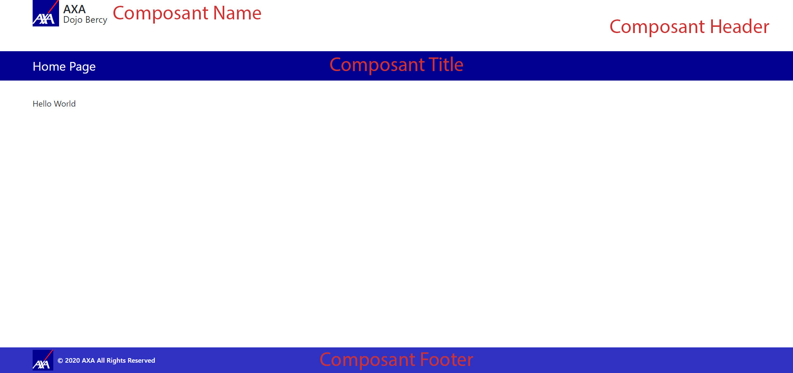

## 3.1 Initialisation d'un projet React

Nous avons vu dans le chapitre précèdent qu’il y a plusieurs manières de faire du React. Une des manières que nous avons jusqu’ici consiste à ajouter les dépendances de **React**, **React Dom** et **Babel** via le service **unpkg**. Cette méthode est très peu performante et même déconseillé quand il s’agira de réaliser un projet de grande envergure qui implique un travail en équipe et des mécaniques d’industrialisation (intégration continue, …).

React mets à disposition un environnement qui permet de démarrer confortablement un projet. C’est le **Create React App** ou **CRA**.

> Le **CRA** configure votre environnement de développement de façon à vous permettre d’utiliser les dernières fonctionnalités de JavaScript, propose une expérience développeur agréable et optimise votre application pour la production.

[Aller plus loin sur le CRA](https://create-react-app.dev/docs/getting-started/)

## 3.2 Initialiser un projet AXA

Avant de commencer, il faut avoir fait les prérequis partie 2.

La Cop Frontend met à disposition un starter. C’est un projet basé sur le CRA et qui met à disposition les librairies de base qu’elle recommande. De plus, le starter intègre une architecture de projet préconisée par la COP et aussi par le toolkit Axa.

Pour plus de lisibilité, nous avons volontairement allégé ce starter.

Ouvrir votre visual « Studio Code » sur le projet cloné, c’est-à-dire le dossier « dossierdudojo/bercy ». Dans la barre latérale, trouver dans le bloc extension « npm Script » la commande npm run start. Cliquer dessus, une console devrait s’ouvrir directement sur votre Visual Studio Code. 
Il est possible aussi de lancer la commande « npm run start » directement depuis votre console « Git » ou même depuis le fichier package.json avec un clic droit sur le commande « npm start ».

Une fois lancé, le navigateur va s’ouvrir sur une page avec Hello World.

Dans le dossier de bercy, les deux fichiers essentiels sont :

- Index.js -> Fichier qui sert à initialiser l’application React.
- App.js -> le composant App qui affiche le message « Hello Wolrd ». C’est dans ce composant que nous ferons nos exercices. Mais tout d’abord une présentation « toolkit Axa » s’impose.

## 3.3 Le Toolkit AXA

Le toolkit est un design système c’est-à-dire un ensemble de composants web qui respecte la charte graphique AXA. C’est un projet Open source. Les principaux contributeurs viennent de la Coop frontend. Les composants sont exposés via un Storybook.

- Un Storybook est un outil open source qui permet de développer des composants UI de manière isolée pour React, Vue, Angular…

- Un Design System est un outil développé pour des besoins internes sur l’homogénéisation des développements front-end des applications métiers. Il permet de définir les guidelines UX et les règles de parcours utilisateurs.

Pour en savoir plus :
- [Design System AXA](https://axaguildev.github.io/fr/react-toolkit)

- [Storybook AXA](https://axaguildev.github.io/react-toolkit/latest/storybook/index.html?path=/story/get-started--introduction)

**:weight_lifting_man: Exercice 4: Header et Footer de Bercy**
En vous basant sur le code préalablement téléchargé (voir partie 4.2), vous allez mettre en place ce Design pour votre application



Le storybook recense l’ensemble des composants du toolkit que vous utiliserez. Dans cet exercice, vous utiliserez les composants suivants :

- Header
- Name
- Footer
- Title

Avant tout, vous devez intégrer cette feuille de style dans le composant App. Référez-vous au chapitre 2.5
Le code :

```
/***************************************************
************CSS pour l'application
***************************************************/
.app {
  width: 100%;
  min-height: 100vh;
  display: flex;
  flex-direction: column;
}
.app-content {
  flex-grow: 1;
}

@media (min-width: 1200px) {
  .container,
  .container-lg,
  .container-md,
  .container-sm,
  .container-xl {
    max-width: 1440px;
  }
}
/***************************************************
************FOOTER
***************************************************/
.af-footer {
  background-color: #3032c1;
  padding: 5px 0;
  min-height: 45px;
}
.af-footer-content {
  color: #fff;
  font-weight: 600;
}
```

Le code importé, vous allez mettre en place un composant du toolkit. Allez directement sur le storybook, et tapez le nom du composant dans la colonne de gauche pour le rechercher. Une fois affiché, cliquez dessus directement. La page principale va se rafraichir et affichr le composant.

Vous retrouverez en bas de page les colonnes suivantes : Actions, Knobs, Story, Accessibility et Readme. Cliquez sur Readme pour trouver un exemple d’utilisation de votre composant. Attention, dans chaque exemple, vous trouverez le code pour importer un ou plusieurs composants du toolkit.
Exemple :

```
import { Header, Name, Footer } from '@axa-fr/react-toolkit-layout-footer';
```

Pour des questions de facilité, nous avons préféré importer l’ensemble du toolkit plutôt qu’une partie des composants. Dans notre exemple, ça donnera ceci :

```
import { Header, Name, Footer } from '@axa-fr/react-toolkit-all';
```

Retrouvez ici, l'esemble des composants à utiliser :

### Composants header et Name
####  Exemple :

```javascript
import React from 'react';
import { Header, Name } from '@axa-fr/react-toolkit-all';
import logo from '@axa-fr/react-toolkit-core/dist/assets/logo-axa.svg';

const MyHeader => (
  <Header>
    <Name
      title="Ma nouvelle application"
      img={logo}
      alt="Logo React"
      onClick={() => {}}
    />
  </Header>
);
```

### Composant Footer
#### Exemple :

```javascript
import React from 'react';
import { Footer } from '@axa-fr/react-toolkit-all';

const MyFooter => (
  <Footer icon={logo} copyright="© 2017-2018 AXA Webcenter" />
);
```

### Composant Title

#### Exemple

```javascript
import React from 'react';
import Title from '@axa-fr/react-toolkit-all';

const MyTitle => (
  <Title title="Toolkit Axa" subtitle="Info complémentaire" />
);
```

## 3.4 Architecture de votre projet.

L’exercice terminé, votre page a pris forme.
Nous allons détailler ici l’architecture recommandée par la Cop Frontend.
Effectivement, si vous avez plusieurs pages, vous n’allez pas mettre à chaque fois votre template sur chaque composant comme Header, TitleBar, Footer, etc …

Dans ce but, nous allons mettre en place cette archi :

> (Attention, l’utilisation de majuscules n’est autorisée que pour les composants)

### Structure

    layout
        App
        Header
        Footer
        Routes
    pages
        MyComponent1
        MyComponent2
    shared
        components
            SharedComponent
        helpers
        images
        styles
        
- Dossier Layout : Il contient les composants généraux de l'application comme l'en-tête, le pied de page, le menu, etc.

- Dossier Pages : Il contient le contenu des pages.

- Dossier Shared :

  -- components : c’est l’ensemble des composants réutilisables
  
  -- helpers : l’ensemble des classes ou outils qui contiennent du code susceptible d'être utilisable partout dans une application.
  
  -- images : l’ensemble des images
  
  -- styles : l’’ensemble des feuilles de style
  

**:weight_lifting_man: Exercice 5 : En vous basant sur le code de App.js, définissez cette nouvelle architecture avec :**

**- un composant « App » qui contiendra les composants qui forment votre page (header, title, footer)**

**- un composant « Home » qui contiendra le contenu de votre page**
