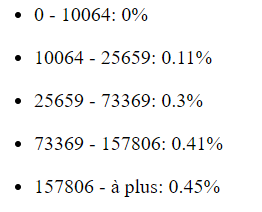

## 1.1 CreateElement API

React.createElement est l’api de base de React. Il nous permet de créer des éléments que l’on peut accrocher à notre document (DOM)

```javascript
const title = React.createElement("h1", {}, "Bienvenue sur le site Bercy");
ReactDOM.render(title, document.querySelector("#app"));
console.log(title);
```

Quelle est la difference avec

```javascript
document.querySelector("#app").innerHTML =
  "<h1>Bienvenue sur le site Bercy</h1>";
```

Pour connaitre la difference, comparons les deux blocs de code ci-dessous:

**Rendu sans React**

```javascript
let compteur = 0;

function renduSansReact() {
  document.querySelector("#app").innerHTML =
    "<h1>Bienvenue sur le site Bercy <span> " + compteur + " </span></h1>";
}
renduSansReact();
window.setInterval(() => {
  compteur++;
  renduSansReact();
}, 1000);
```

**Rendu avec React**

```javascript
let compteur = 0;

function renduAvecReact() {
  const title = React.createElement(
    "h1",
    {},
    "Bienvenue sur le site Bercy",
    React.createElement("span", {}, compteur)
  );
  ReactDOM.render(title, document.querySelector("#app"));
}
renduAvecReact();
window.setInterval(() => {
  compteur++;
  renduAvecReact();
}, 1000);
```

## 1.2 Qu'est ce que le jsx

C'est une syntaxe qui nous permet de décrire du React un peu plus simplement sans utiliser React.createElement. Elle n'est pas comprise par le navigateur.
_Le code ci-dessus deviendrait :_

```jsx
const title = <h1>Bienvenue sur le site Bercy</h1>;
```

Pour utiliser JSX nous avons besoin de **Babel**. **Babel** permet de convertir du code moderne vers du code un peu plus ancien supporté par les vieux navigateurs. Il supporte le JSX.

:mechanic: **Testons ce que fait Babel**

Copier le code jsx ci-dessus et le coller dans le traducteur babel pour observer la traduction en javascript [Traducteur Babel](https://babeljs.io/repl#?browsers=defaults%2C%20not%20ie%2011%2C%20not%20ie_mob%2011&build=&builtIns=false&spec=false&loose=false&code_lz=Q&debug=false&forceAllTransforms=false&shippedProposals=false&circleciRepo=&evaluate=false&fileSize=false&timeTravel=false&sourceType=module&lineWrap=true&presets=env%2Creact%2Cstage-2%2Cenv&prettier=false&targets=&version=7.11.1&externalPlugins=)

#### Comment ajouter Babel à notre projet?

Modifier le fichier _index.html_ pour ajouter la dependance Babel

```diff
+ <script src="https://unpkg.com/babel-standalone@6/babel.min.js" defer></script>
! <script src="app.js" type="text/babel" defer></script>
```

:mechanic: **Passons en JSX notre code de bienvenue**

```jsx
function WelcomeMessage() {
  const title = (
    <h1>
      Bienvenu sur le site de Bercy <span> Yannick</span>
    </h1>
  );
  return title;
}
// rendu dans le DOM
ReactDOM.render(WelcomeMessage(), document.querySelector("#app"));
```

[JsFiddle](https://jsfiddle.net/thies05/9nkvzase/367/)

## 1.3 La syntaxe JSX

### 1.3.1 Interpolation

Pour dynamiser le contenu de notre jsx, nous avons besoin d'injecter des variables et des expressions dans le code. Le JSX nous permet d'injecter du code javascript à travers les "moustaches"
_**{mon expression javascript}**_

:mechanic: **Ajoutons le nom du user à notre message de bienvenue**
&

```jsx
const userName = "Yannick";

function WelcomeMessage() {
  const title = (
    <h1>
      <span>Bienvenu sur le site de Bercy {userName}</span>
    </h1>
  );
  return title;
}
// rendu dans le DOM
ReactDOM.render(WelcomeMessage(), document.querySelector("#app"));
```

[Jsfiddle](https://jsfiddle.net/thies05/9nkvzase/393/)

> Tous les elements HTML5 sont utilisables de manière equivalente dans la syntaxe JSX.

### 1.3.2 Les attributs: _id_, _classeName_, _children_

- **id**: Permet d'identifier de manière unique un element JSX. Il est l'equivalent de l'attribut id des elements du DOM.
- **className**: Il permet d'appliquer du style à notre element. Il correspond à l'attribut class du DOM.
- **children**: Il correspond à l'element fils d'un element jsx. Il peut être de type jsx, primitif ou une expression javascript.

> - Il existe d'autres attribut: checked, value, tabindex ....
> - La valeur des attributs passés au elements JSX sont appellés des Props.

```jsx
const userName = "Yannick";

function WelcomeMessage() {
  const className = "bercy-bienvenue-msg";
  const title = (
    <h1 id="unique-id" className={className}>
      <span> Bienvenu sur le site de Bercy {userName}</span>
    </h1>
  );
  return title;
}
// rendu dans le DOM
ReactDOM.render(WelcomeMessage(), document.querySelector("#app"));
```

[Jsfiddle](https://jsfiddle.net/thies05/9nkvzase/395/)

### 1.3.2 Les basiles auto fermentes

Quand l'element jsx n'a pas de children, la balise peut être auto-fermante

```diff
- const title = <h1 id={uuid()} className={className} children={message}></h1>;
+ const title = <h1 id={uuid()} className={className} children={message} />;
```

## 1.3.3 Conditions

> En Jsx, _false_, _null_, _undefined_, sont des elements valides. Ils ne sont simplement pas exploités. Ces expressions JSX produiront toutes la même chose. Ça peut être utile pour afficher des éléments React de façon conditionnelle

```jsx
function WelcomeMessage(userName) {
  const isUserConnected = userName !== "";
  return (
    <div>
      {isUserConnected && (
        <header>Bienvenue sur le simulateur Bercy {userName}</header>
      )}
      <em>
        Bercy est projet proposé par C.Merlen qui permet de faire une estimation
        de vos impots
      </em>
    </div>
  );
}
// rendu dans le DOM
ReactDOM.render(WelcomeMessage(""), document.querySelector("#app"));
```

[Jsfiddle](https://jsfiddle.net/thies05/9nkvzase/336/)

On peut aussi utiliser les condtions ternaires.

**:weight_lifting_man: Exercice 1**
**Afficher le montant d'imposition**

Ecrire une fonction **DisplayImpot** qui reçoit en paramètre le montant de vos impôts et affiche les messages suivants.

- Si le montant des impôts est supérieur à 0 : _« Le montant de vos impôts est :xxxxx »_
- Sinon on affiche vous n’êtes pas imposables.

[Jsfiddle](https://jsfiddle.net/thies05/cx93rhLg/15/)

## 1.3.5 Boucles

```jsx
function DisplayTranchesImpot({ tranches }) {
  const tauxInpositions = tranches.map((tranche) => (
    <li key={tranche.id}>{tranche.tauxImposition}</li>
  ));
  return <ul>{tauxInpositions}</ul>;
}
```

[Jsfiddle](https://jsfiddle.net/thies05/9nkvzase/402/)

## 1.3.4 React fragment

En React, il est courant pour un composant de renvoyer plusieurs éléments. Les fragments nous permettent de grouper une liste d’enfants sans ajouter de nœud supplémentaire au DOM.

```jsx
function RenderFragment() {
  return (
    <React.Fragment>
      <ElementA />
      <ElementB />
      <ElementC />
    </React.Fragment>
  );
}
```

**où bien**

```jsx
function RenderFragment() {
  return (
    <>
      <ElementA />
      <ElementB />
      <ElementC />
    </>
  );
}
```

**:weight_lifting_man: Exercice 2**
**Afficher les tranches d'imposition avec leur details**

- Nous possédons une methode qui permet de retourner les tranches d'imposition _**getAllTranches()**_
- **Travail à Faire**

  - Afficher les tranches d'imposition avec les details comme ci-dessous:
  - Pensez à eviter ce message: **Warning: Each child in a list should have a unique "key"**

    

    **Code de base**

    ```javascript
    function getAllTranchesAsync() {
      return [
        {
          id: 1,
          tauxImposition: 0.0,
          limiteInf: 0,
          limiteSup: 10064,
        },
        {
          id: 2,
          tauxImposition: 0.11,
          limiteInf: 10064,
          limiteSup: 25659,
        },
        {
          id: 3,
          tauxImposition: 0.3,
          limiteInf: 25659,
          limiteSup: 73369,
        },
        {
          id: 4,
          tauxImposition: 0.41,
          limiteInf: 73369,
          limiteSup: 157806,
        },
        {
          id: 5,
          tauxImposition: 0.45,
          limiteInf: 157806,
        },
      ];
    }

    function AffichertranchesImposition() {
      // Votre code ICI
    }

    // rendu dans le DOM
    ReactDOM.render(
      AffichertranchesImposition(),
      document.querySelector("#app")
    );
    ```

    <!-- [Solution boucle](https://jsfiddle.net/thies05/9nkvzase/341/) -->

[Pour aller plus loin](https://fr.reactjs.org/docs/introducing-jsx.html)
