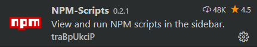
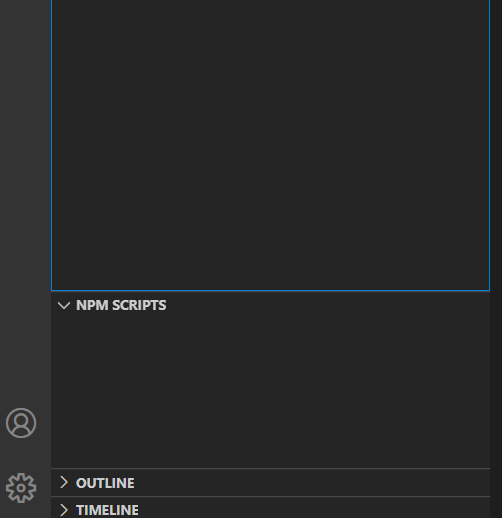

## Avant de commencer la partie 2 du dojo

> Avant de commencer la partie 2 de notre dojo, vous devez configurer à nouveau votre poste.

#### Installation de git

Afin de télécharger les sources pour ce dojo, vous devez préalablement télécharger et installer git sur votre poste si cela n’a pas déjà été réalisé.
Lien : https://git-scm.com/

Une fois installé, vous avez le choix entre lancer des commandes via Visual Studio Code ou la console de git.

#### Configuration Visual Studio Code (non obligatoire)
Nous allons ajouter une nouvelle extension. Lancer l'éditeur, une fois l’écran affiché, cliquer sur l’icône « Extensions », elle se situe sur la barre latérale de gauche.
Installer cette extension « Npm-Scripts »



Dès l’installation, un nouveau menu s’affichera dans la barre latérale.



#### Télécharger le dépôt « Git »

Ouvrir une console (« Git » par exemple) et aller directement sur le dossier du dojo.

Exemple :
```
cd c:/dev/dojo/dojo-react/
```

Une fois dans le dossier, saisir cette nouvelle ligne de code depuis la console :

```
git clone https://github.com/barry-thierno/bercy.git
```

Le téléchargement étant effectué, vous allez changer de dossier

```
cd bercy
```

Vous allez installer dès à présent les dépendances avec npm. 
Saisir dans la console :

```
npm install
```

Après quelques minutes, l’installation sera terminée. Vous pouvez alors démarrer la partie 2 du dojo.
