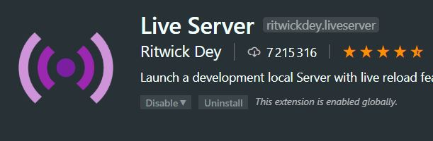
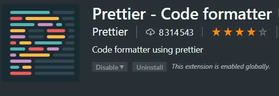

## Avant de commencer

> Avant de commencer ce Dojo sur React, vous devez configurer votre poste.

#### Quel éditeur de code utiliser ?

Vous pouvez utiliser n’importe quel éditeur de code, et si vous n’avez pas encore fait votre choix, nous vous conseillons d’utiliser Visual Studio Code (gratuit et maintenu par Microsoft).

#### Télécharger Visual Studio Code

Cliquez sur ce lien, https://code.visualstudio.com/ afin de télécharger l’éditeur de code

#### Configuration Visual Studio Code

Une fois Visual Studio Code installé sur votre poste, nous allons ajouter des extensions qui vous seront fort utiles lors des phases de live coding.
Lancer l'éditeur, une fois l’écran affiché, cliquer sur l’icône « Extensions », elle se situe sur la barre latérale de gauche.
_Installer ces deux extensions : _

- Prettier Formatter
- Live Server





#### Configuration Prettier

Utiliser le raccourcis, Ctrl + P depuis Visual Code Studio
Une fois la console affichée, mettez ceci ">preferences: Open Settings (Json) " puis taper sur « Entrée »

Remplacer le code json par ceci :

```javascript
{
    "prettier.singleQuote": true,
    "editor.formatOnSave": true,
    "[javascript]": {
        "editor.formatOnSave": true,
    },
    "window.zoomLevel": 0
}
```

**Enregistrer le fichier et redémarrer votre éditeur. Voilà, vous êtes enfin prêt pour l’aventure 😊**
