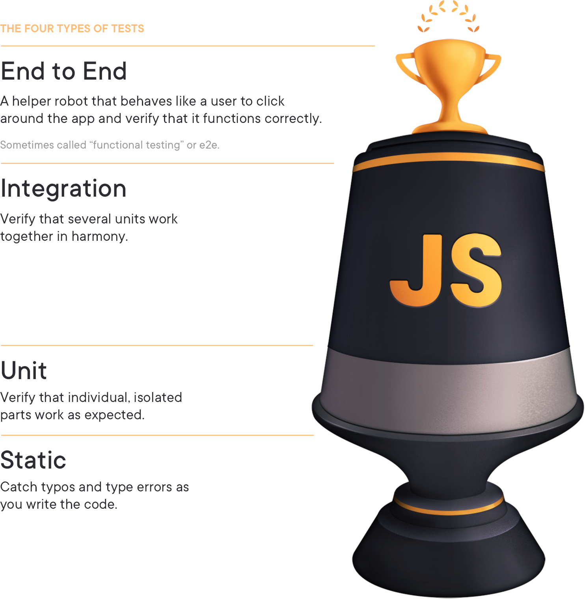
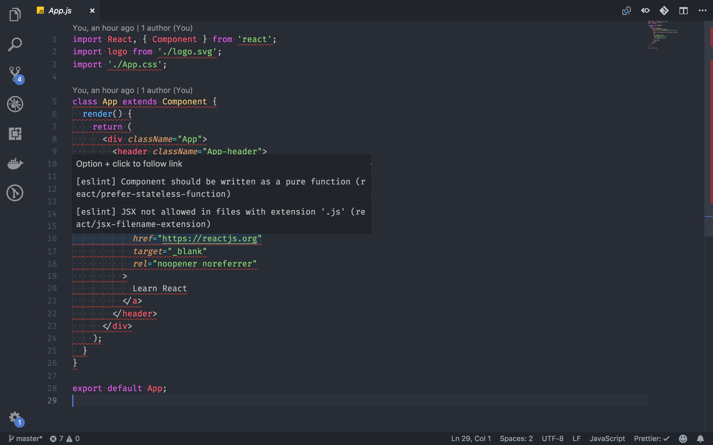

<h1>Tester ses composants React</h1>

_Par Olivier YOUF_ Texte original sur [Component Testings](https://github.com/youf-olivier/componentsTesting)

- [Analyse statique](#analyse-statique)
  - [EsLint](#eslint)
  - [Prettier](#prettier)
  - [Plugins](#plugins)
  - [Typescript](#typescript)
- [Tests unitaires](#tests-unitaires)
  - [Jest](#jest)
    - [Les matchers](#les-matchers)
    - [Mocker les fonctions avec Jest](#mocker-les-fonctions-avec-jest)
- [Tests d'intégration](#tests-dintégration)
  - [Le test d'intégration](#le-test-dintégration)
  - [Installation](#installation)
  - [Tester la vue](#tester-la-vue)
  - [Tester strictement la vue : les requêtes](#tester-strictement-la-vue--les-requêtes)
  - [Faciliter les assertions : Jest Dom](#faciliter-les-assertions--jest-dom)
  - [Tester les interactions : User Event](#tester-les-interactions--user-event)
  - [Tester les rendus asynchrones : waitFor](#tester-les-rendus-asynchrones--waitfor)
- [Pour aller plus loin : Partie 2](#pour-aller-plus-loin--partie-2)

Avoir un code qui marche c'est bien, mais être sûr de son bon fonctionnement et de sa pérennité c'est mieux. C'est ce qu'on appelle la qualité. Et pour cela il existe un panel d'outils que nous allons voir ensemble.

## Comment tester son application

Un projet React est un ensemble complet et complexe de composants, de fonctions et de patterns en tous genres. Nous allons voir tout au long de ce chapitre les différents outils qui sont à notre disposition pour tester son application



> Répartition idéale des tests dans un projet.

Voyons cela ensemble, en remontant le trophée, nous avons :

- **La vérification statique :** grace aux outils tels que *Eslint* ou *Prettier* nous allons faire une première vérification statique de code.
- **Les tests unitaires :** Nous allons pouvoir tester des pans de code javascript afin de vérifier que le code fait ce qu'on attend de lui.
- **Les tests d'intégration :** Ici nous cherchons a vérifier que les composants fonctionnent correctement entre eux.
- **Les tests end to end :** Ce type de test, bien plus couteux en temps, va tester l'application de bout en bout.

Durant cette série d'exercices nous allons nous concentrer sur les 3 premiers éléments. Les tests End to End pourront être vus à ultérieurement.

# Analyse statique

Avant de tester quoi que ce soit, nous pouvons déjà analyser statiquement son code. Cette pratique est une aide qui va permettre de dégrossir tout ce qui erreur de frappe, ou qualité de base du code. On va ainsi éliminer toute une catégorie de bugs à l'aide de quelques outils de base.

## EsLint 


Eslint est un *linter*, un utilitaire qui va analyser le code de manière statique pour y déceler tout un ensemble de problèmes à partir de règles prédéfinies. On peut choisir d'ajouter un linter pour le javascript mais également pour React.

De base il est présent dans les solutions générées par Create React App. Le cas échéant, rien de plus simple, il suffit de se laisser guider par le CLI :

```
npx eslint --init
```

ensuite on peut le lancer localement,

```
npx eslint .
```

ou, mieux, configurer un script dans le package.json

```json
 "scripts": {
     ...
    "lint": "eslint --ignore-path .gitignore .",
  },
```

Afin d'éviter de scanner les node_modules ou tout autre fichier généré, nous indiquons que nous ne voulons scanner que ce qui sera envoyé sur le repo distant. Pour cela nous nous appuyons sur le fichier gitignore.

Vous pourrez ensuite à loisir modifier les règles, en importer des nouvelles (plugins) ou appliquer des templates (extends)

❗️ N'oubliez pas d'ajouter une configuration afin de scanner les bons fichiers ❗️

```json
"eslintConfig": {
  "extends": [
    "react-app",
    "react-app/jest"
  ],
  "overrides": [{"files": ["**/*.js?(x)"]}]
}
```

## Prettier 


*Prettier*, à l'instar d'*EsLint*, va venir également analyser le code mais en se focalisant sur le formatage. Il va venir regarder l'indentation, le placement des parenthèses, les virgules, les espace etc. C'est un outil à ne pas négliger car il permettra d'avoir, au sein d'une équipe, un code homogène. De plus, avoir des règles partagées et automatiques permettra de ne plus se préoccuper de la mise en page et de supprimer ces modifications qui polluent les Pull Requests.

Attention cependant, prettier et EsLint peuvent entrer en conflit, il faudra donc ajouter le plugin prettier d'eslint qui va venir simplement désactiver les règles esLint qui peuvent entrer en conflit avec Prettier.

Rien de plus simple ici aussi.

```
npm install --save-dev prettier
```

Puis ensuite configurer la tache

```json
"scripts": {
    ...
    "lint": "eslint --ignore-path .gitignore .",
    "format": "prettier --ignore-path .gitignore --write \"**/*.+(js|jsx|json)\""
  }
```

De la même manière nous ignorons les fichiers du gitignore pour ne se concentrer que sur les fichiers à pousser.

## Plugins

Afin de fluidifier leur utilisation, il existe des extensions sur la plupart des éditeurs de code, qui permettra de voir les erreurs esLint et de formater les fichiers à la sauvegarde.



## Typescript

Avec TypeScript nous allons atteindre un niveau supplémentaire de validation statique. Avec la mise en place des types, le code va pouvoir être vérifié à la compilation à l'aide de la validation de type.

🏋️‍♀️ Pas d'exercice ici, le Typescript est un sujet à part entière.

# Tests unitaires

Les tests unitaires sont connus de tous et ne nécessitent pas de connaissance particulière. Il faut cependant faire attention à plusieurs points, pour ne pas se perdre dans la pratique. Un test unitaire sert a tester du code isolé et indépendant. Pour cela il est important de faire attention à :

- **Couverture :** Ne pas chercher 100% de couverture de code avec les Tests unitaires, c'est contre productif et fait perdre un temps infini
- **Que tester :** les tests unitaires vont vous servir à tester des fonctions pures, des services, du code isolé.

Voici cependant les outils à connaitre, et qui vont nous servir pour la suite.

## Jest

Jest est devenu l'outil incontournable et préconisé pour tester son application JS. Il est de base fourni par Create React App, nous n'allons pas nous attarder sur son installation. Pour écrire son premier test nous devons juste suivre la convention de nommage (.spec, .test ou dans un répertoire "\_\_test\_\_")

Reste ensuite à lancer la commande

```
npm run test
```

Les tests vont être lancés en mode "watch", c'est à dire qu'il se relanceront automatiquement dès qu'une modification de fichier sera détectée.

Pour écrire un test, il y a toujours les 3 parties que vous connaissez sans doutes déjà : **ARRANGE, ACT, ASSERT.**

Le test est écrit à l'intérieur d'une fonction contenu dans un bloc it (ou test) que l'on peut lui même intégrer dans un bloc describe (afin de faire des regroupements logiques)

```javascript
describe("Mon jeu de tests", ()=>{
  it("1+2 devrait retourner 3", ()=>{
    // arrange and act
    const result = 1+2;
    // assert 
    expect(result).toEqual(2);
  })
})
```

### Les matchers

Pour écrire un test, il y a toujours les 3 parties que vous connaissez sans doutes déjà : **ARRANGE, ACT, ASSERT.** Avec la fonction **expect**, nous allons pouvoir accéder aux matchers pour mettre en place les assertions qui permettront de valider le test. Voici une liste des matchers les plus communs : 

- **toEqual** : le plus commun des plus communs. On vérifie une égalité de valeur. Sur une object, il effectue une comparaison récursive.
- **toBe** : vérifie une égalité au niveau de la référence. 
- **toBeFalsy/toBeTruthy**
- **toBeNull/toBeUndefined**

En chainant le expect avec le not nous pouvons indiquer que nous voulons vérifier le résultat inverse. Par exemple :

```javascript
// true 
expect(1+2).toEqual(3);
// true
expect(2+2).not.toEqual(3);
```

> **🏋️‍♀️ Ouvrez la solution et écrivez les tests du [premier exercice Jest](https://codesandbox.io/s/bercy-tests-2gy1w?file=/src/shared/taxComputer.helper.spec.js)**

### Mocker les fonctions avec Jest

Il arrive que nous ayons à tester des fonctions faisant appel à d'autres fonctions. Ces fonctions, injectées ou importées directement vont poser une problématique : 

- Elles rendent la fonction impure et peuvent rendre le test instable dans la durée (ajouter un math.Random et le test ne marche plus tout le temps)
- On veut pouvoir vérifier que l'appel a été fait, ou non, dans de bonnes conditions.

Si la fonction est interne et qu'elle est pure, il n'est pas nécessaire de la tester à part ou de la mocker. Sauf si sa complexité et des tests séparés permettent une meilleure lisibilité, ce genre de fonctions est testé au sein même de la fonction principale.

Regardons cet exemple.

```javascript
const calcul = (a, b, fn) => {
  const c = 10*a;
  const d = 10*b;
  return fn(c, d);
}
```

Ici nous allons vérifier que la fonction *fn* est appelée avec les bons paramètres et qu'elle nous retourne le bon résultat.

Pour cela nous allons remplacer la fonction existante :

```javascript
const fn = jest.fn((a, b)=>a + b);
```

Ici nous avons remplacé une fonction simple par une fonction mockée renvoyant une simple addition. 

Une fois la fonction principale appelée, nous allons pouvoir faire nos vérifications. Pour cela nous allons pouvoir utiliser des matchers spécifiques. Voici les principaux.

```javascript
it("effectue un appel vers fn", () => {
  // Arrange
  const fn = jest.fn((a, b)=>a + b);
  
  // Act
  const result = calcul(3, 5, fn);
  
  //Assert 
  expect(result).toEqual(70);
  
  expect(fn).toHaveBeenCalled();
  expect(fn).toHaveBeenCalledTimes(1);
  expect(fn).toHaveBeenCalledWith(30, 50);
  expect(fn).toHaveBeenNthCalledWith(1, 30, 50);
})
```

Attention, des fonctions asynchrone ne renvoient pas de résultat, mais des promesses de résultats :
```javascript
const asyncFnMock = jest.fn(()=> Promise.resolve("result"));
```

> 🏋️‍♀️ **Ouvrez la solution et écrivez les tests du [deuxième exercice Jest](https://codesandbox.io/s/bercy-tests-2gy1w?file=/src/pages/Home/FilterableSliceTable/FilterableSliceTable.s.spec.js) du chapitre Jest**


# Tests d'intégration

Tester une fonction pure qui retourne un résultat simple est facile à appréhender et maitriser. Cependant en React nous allons devoir aller un peu plus loin. En tant qu'interface utilisateur, pour tester le composant, nous allons tester son comportement. Pour cela nous allons utiliser [React Testing Library](https://testing-library.com/docs/react-testing-library/intro/). 

## Le test d'intégration

Tout d'abord nous devons différencier le test d'intégration du test unitaire.

<blockquote class="twitter-tweet"><p lang="en" dir="ltr">The more your tests resemble the way your software is used, the more confidence they can give you.</p>&mdash; Kent C. Dodds 🚀 (@kentcdodds) <a href="https://twitter.com/kentcdodds/status/977018512689455106?ref_src=twsrc%5Etfw">March 23, 2018</a></blockquote> <script async src="https://platform.twitter.com/widgets.js" charset="utf-8"></script>

La philosophie est là. Le test d'intégration c'est :

- 🤜🏻 Tester efficacement qu’un composant fait exactement ce qu’attend l’utilisateur. **Plus que couvrir du code, nous allons couvrir les cas d’utilisations**. Nous allons lister les scénarios et les tester.
- 💨 Être **résiliant à la refactorisation** qui est par définition une modification du code sans impact sur les fonctionnalités.
- 🤝 Augmenter sensiblement la confiance dans ce qui est produit. Une fois le composant sécurisé par ses tests, nous sommes confiant sur la fonctionnalité.
- 💰 Plus couteux (un peu) qu’un test unitaire mais moins que le test End-To-End

> Il faut user et abuser des tests d'intégration par rapport aux tests unitaire.


> - ✅ La porte 1 s'ouvre
> - ✅ Les portiques s'ouvrent
> - Tests : <span style="color:green">**2 passed**</span>, 2 total

## Installation

React Testing library n’est pas seulement une librairie, c’est un vrai écosystème. Nous allons voir à travers nos couches, les différentes façons de couvrir notre application.

```
npm install --save-dev @testing-library/react
```

C’est la base, ce qui va nous permettre d’utiliser le render de composant.

```
npm install --save-dev @testing-library/user-event
```

Cette partie va nous permettre de simuler les actions de l’utilisateur.

```
npm install --save-dev @testing-library/jest-dom
```

Ici c’est plus une boite à outil, vraiment très utile. Elle va venir enrichir les fonctions disponibles pour valider nos tests.

```
npm install --save-dev @testing-library/react-hooks react-test-renderer
```

Le package react hooks sera utile uniquement pour tester des hooks réutilisables. Pour les hooks des containers, nous les testerons directement au sein de leur composant avec React Testing Library.

Ce package nécessite react-test-renderer qu’on doit installer en plus.
Une fois ces librairies installées, en fonction de vos besoins, nous pouvons faire une toute petite configuration dans le fichier setupTests.js

```
import '@testing-library/jest-dom';
```

Cet import, nécessaire pour utiliser les extensions de Jest-dom, sera de ce fait effectué pour chaque test.

---

❗️ _Si vous utilisez React Script (Create React App) antérieur à la version 4, ce dernier embarque la version de Jest 24. Malheureusement la librairie de tests nécessite Jest 26 (pour l’utilisation de waitFor par exemple). De ce fait vous devez embarquer jest-environment-jsdom-sixteen_

```
npm install --save-dev jest-environment-jsdom-sixteen
```

Puis l’ajouter dans les scripts de lancement de tests dans votre package.json :

```json
"scripts": {
...,
  "test": "react-scripts test --env=jest-environment-jsdom-sixteen"
...
}
```

## Tester la vue

La vue va se tester en deux étapes.

Dans un premier temps nous allons poser un filet de sécurité pour alerter le développeur en cas de modification : **Le snapshot**.

Le snapshot est un sujet qui déchaine les foules. Il est pourtant assez mineur et ne représente qu’une faible partie de la pratique. Il a juste un rôle d’avertissement. Sur une vue simple il sera suffisant, sur une vue plus spécifique, nous le verrons ensuite, il devra être accompagné.

```javascript
it('renders correctly', () => {
  const { asFragment } = render(<User user={user} />);
  expect(asFragment()).toMatchSnapshot();
});
```

Différence asFragment / container :

- **Container** : Contient le DOM et est **mutable**
- **AsFragment** : Renvoi un DocumentFragment qui est un objet minimal et **immutable**

> **🏋️‍♀️ Basez vous sur les tests existants pour tester les vues simples et sans logique. ( [RTL Exercice 1](https://codesandbox.io/s/bercy-tests-2gy1w?file=/src/pages/Home/FilterableSliceTable/SliceTableRow/SliceTableRow.spec.js))**

Ce qui est bien avec le JSX c’est que nous pouvons poser, au besoin des conditions, des mappers, des boucles etc.

Il s'agit de logique et donc afin de vérifier et tester correctement ces éléments nous devons donc accompagner le snapshot. La lecture du test doit indiquer ce que nous vérifions, et le snapshot ne le permet pas.

Pour cela nous allons devoir explorer le contenu du rendu à travers les **requêtes**.

## Tester strictement la vue : les requêtes

Cette requête est composée de deux choses : le comment et le quoi.

Le comment est la première partie. Nous allons indiquer comment récupérer ce que nous voulons chercher. Nous avons :

- **get[All]By** : Ici nous voulons récupérer un élément. Si la requête échoue si aucun ou plusieurs éléments sont trouvés. Si nous ajoutons All nous indiquons que nous voulons tous les éléments trouvés qui seront renvoyés sous forme de liste.
- **query[All]By** : Fonctionne de la même façon que le get, sauf que s’il ne trouve pas d’élément, il renverra null. Utile pour tester la non existence d’un élément.
- **find[All]By** : Fonctionne de la même façon que le get, à la différence qu’il va renvoyer une promesse qui sera résolue une fois l’élément trouvé ou le timeout passé. Outil tout désigné pour tester un appel de service par exemple.

Le quoi va permettre de cibler l’élément. Pour cela il y a une multitude de requêtes. Nous allons en voir les principales, par leur ordre d’importance.

- **ByRole :** C’est LA requête a privilégier. Ici nous allons accéder à l’élément par son rôle (bouton, champ, liste…) souvent accompagné de son name. Cette requête se base sur l’accessibilité de l’élément. Pour plus de détails vous pouvez vous reporter à mon précédent article sur l’accessibilité.

```javascript
// Récupération d'un bouton valider
screen.getByRole('button', { name: 'valider' });
// Récupération d'une liste d'item
screen.getByRole('listitem', { name: 'liste des utilisateurs' });
```

- **ByLabelText :** C’est la méthode à privilégier pour récupérer des champs de formulaire.

```javascript
// Récupération du champ de formulaire dont le label est prénom
screen.getByLabelText(/prénom/i);
```

- **ByText :** Nous allons ici pouvoir récupérer un élément en général non interactif, par rapport à son contenu, par exemple une div ou un span.

```javascript
// Récupération du message quand aucun utilisateur n'est affiché
screen.getByText(/aucun utilisateur trouvé/i);
```

Mais également getByAltText, getByTitle, etc.

Il y a également deux requêtes à connaitre mais à n'utiliser qu'en cas de dernier recours :

Le query selector 

```javascript
const {container} = render(<Component/>);
container.querySelector(".myclass");
```

ByTestId

```javascript
// Récupération d'un élément par son attribut testId
render(
   <div>
      <span data-testid="superspan">☹️</span>
   </div>
);
screen.getByTestId("superspan");
```

## Faciliter les assertions : Jest Dom

Avec Jest Dom nous allons pouvoir faire des assertions explicites

- toBeDisabled
- toBeEnabled
- toBeEmpty
- toBeEmptyDOMElement
- toBeInTheDocument
- toBeInvalid
- toBeRequired
- toBeValid
- toBeVisible
- toContainElement
- toContainHTML
- toHaveAttribute
- toHaveClass
- toHaveFocus
- toHaveFormValues
- toHaveStyle
- toHaveTextContent
- toHaveValue
- toHaveDisplayValue
- toBeChecked
- toBePartiallyChecked
- toHaveDescription

> **🏋️‍♀️ Servez vous de ces nouveaux outils afin de passer sur l'exercice suivant ([RTL exercice 2](https://codesandbox.io/s/bercy-tests-2gy1w?file=/src/pages/Home/TaxResult/TaxResult.spec.js))**


## Tester les interactions : User Event

UserEvent est un package de la librairie qui va faciliter l'interaction utilisateur. Elle est relativement simple et se base sur deux fonctions :

- **type** : Pour simuler le clavier
- **click** : Pour simuler la souris.

```javascript
// Je remplis un formulaire et je le valide.
const input = screen.getByLabelText(/Compte Github/i);
const button = screen.getByRole('button', { name: /Rechercher/ });

await userEvent.type(input, 'gaearon');
await userEvent.click(button);
```

Il en existe d'autre moins courantes : https://github.com/testing-library/user-event#api

> **🏋️‍♀️ Simulez la manipulation d'un champs avec cette nouvelle librairie ([RTL exercice 3](https://codesandbox.io/s/bercy-tests-2gy1w?file=/src/pages/Home/FilterableSliceTable/SliceYearSelect/SliceYearSelect.spec.js))**

## Tester les rendus asynchrones : waitFor

La dernière section que nous allons aborder est sur la gestion du contenu asynchrone. Je vous propose de rester dans la simplicité. Ici on va demander au test d'attendre. Tout simplement.

Deux fonctions vont nous aider, la principale est d'attendre spécifiquement que quelque chose se produise :

```javascript
await waitFor(() => expect(screen.queryByRole('alert', { name: 'loader' })).not.toBeInTheDocument());
```

L'autre est plus spécifique et vous servira nettement moins, mais sera régulièrement necessaire

```javascript
await waitForElementToBeRemoved(screen.queryByRole('alert', { name: 'loader' }));
```

Les plus attentifs auront remarqué que les deux fonctions font la même chose. Mais vous serez d'accord que la seconde est plus explicite. S'il y a une chose à retenir de toute cette partie c'est bien cela :

> **The more your tests resemble the way your software is used, the more confidence they can give you.**

> **🏋️‍♀️ Tester la récupération d'une requête avec UserEvent et le waitFor ([RTL Exercice 4](https://codesandbox.io/s/bercy-tests-2gy1w?file=/src/pages/Home/FilterableSliceTable/FilterableSliceTable.spec.js))**


> **🏋️‍♀️ vous etes autonome pour un composant complet ([RTL Exercice 5](https://codesandbox.io/s/bercy-tests-2gy1w?file=/src/pages/Home/TaxComputationForm/TaxComputationForm.spec.js))**


# Pour aller plus loin : Partie 2

Nous avons ici aborder les manière basqieu de tester son application, dans un dojo test avancés, je vous proposerai d'aborder les sujets suivants :

- Automatiser et industrialiser les linter
- React Testing Library Avancés :
  - Tester les providers
  - Tester les hooks
  - Tester le router
  - Tester Redux
  - Mocker l'api avec MOck Service Worker
